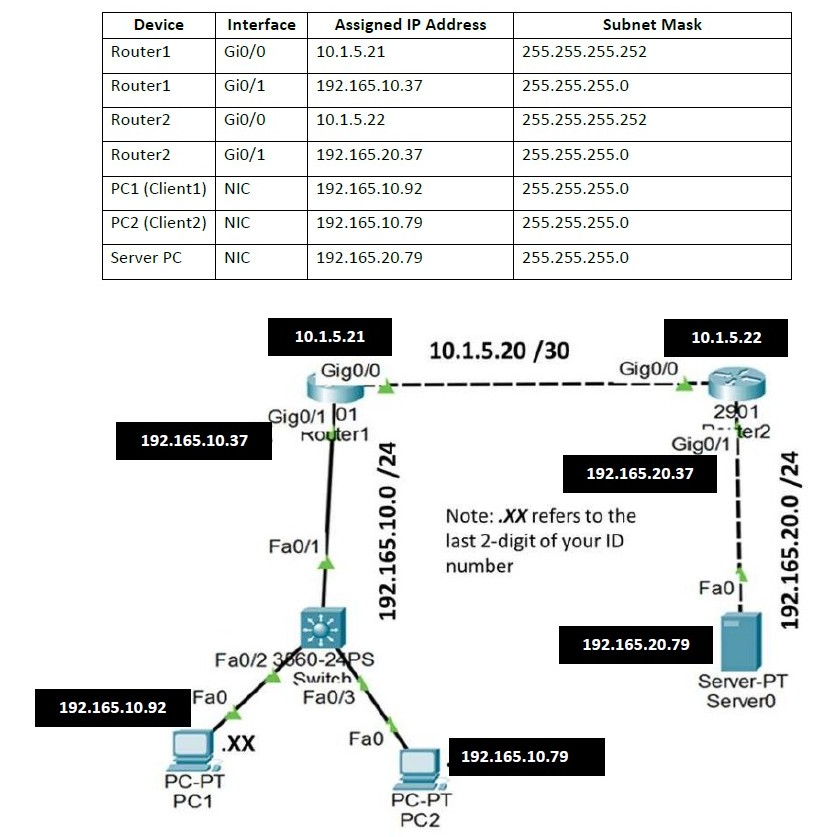
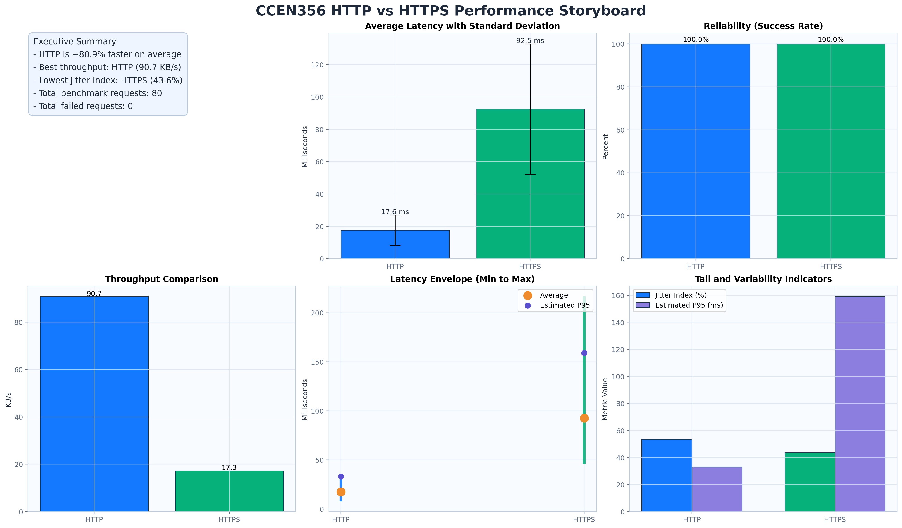
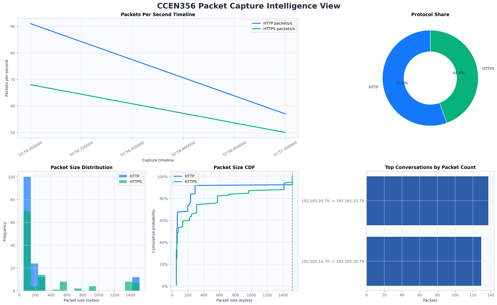
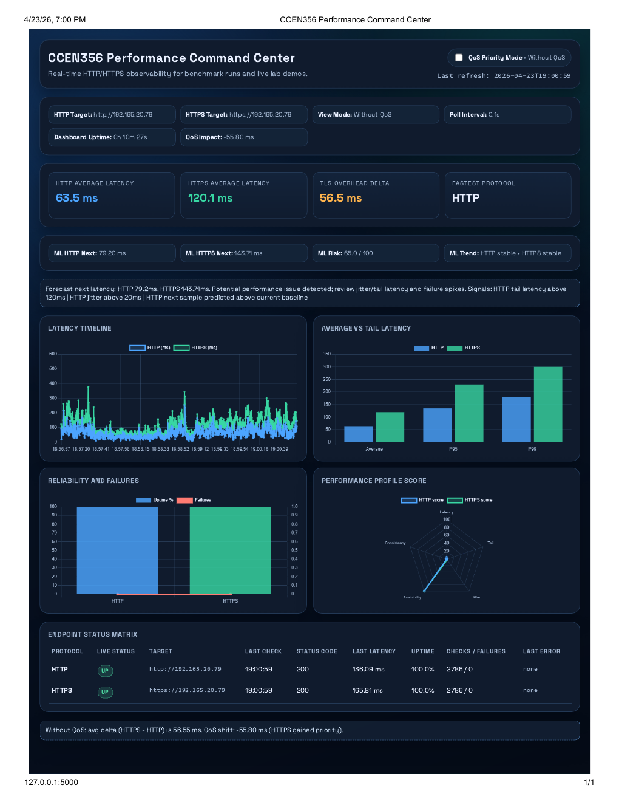

# Design, Implementation, and Analysis of HTTP/HTTPS Performance and Visibility Using Cisco Devices and Python Automation

CCEN 356 Computer Networks course project, Spring 2026, Khalifa University.

This repository contains a physical networking lab that compares HTTP and HTTPS performance and visibility across Cisco routers and a Python-based measurement pipeline. The project uses Cisco 2901 routers, a Cisco Layer 2 switch, static routing, ACLs, QoS, Scapy packet capture, Netmiko automation, Matplotlib visualizations, and a Flask dashboard.

## Overview

The project studies a practical trade-off in modern networks: plain HTTP is easier to inspect and usually has lower request latency, while HTTPS adds TLS handshake and encryption overhead in exchange for confidentiality, integrity, and server authentication.

The lab builds a two-subnet topology connected by a point-to-point WAN link. Client PCs generate HTTP/HTTPS traffic toward a server PC. Python scripts collect router state, measure response times, capture packets, generate charts, and display live metrics in a browser dashboard.



## What This Solves

The project provides a reproducible teaching lab for answering questions such as:

- How much application-layer latency does HTTPS add in a controlled network?
- What can be seen in HTTP packet captures compared with HTTPS captures?
- How do static routes, ACLs, and QoS policies affect end-to-end web traffic?
- How can Python automation reduce manual router checks and performance analysis work?

## Main Features

- Physical Cisco topology with two Cisco 2901 routers, a Cisco switch, two clients, and one web server.
- Static routing between client and server LANs.
- Named ACLs for HTTP/HTTPS filtering and traffic classification.
- QoS policy on Router 1 to prioritize HTTPS and compare behavior with and without QoS.
- Netmiko SSH automation for router operational checks.
- Scapy capture of HTTP/HTTPS packets into CSV logs.
- HTTP/HTTPS benchmark script with average, median, percentile, jitter, throughput, and reliability metrics.
- Matplotlib chart generation for performance and packet-capture analysis.
- Flask HTTP server, HTTPS server, and live dashboard for real-time observability.

## Architecture

```text
Client 1: 192.165.10.92
Client 2: 192.165.10.79
        |
      SW1
        |
R1 Gi0/1: 192.165.10.37
R1 Gi0/0: 10.1.5.21
        |
WAN /30: 10.1.5.20/30
        |
R2 Gi0/0: 10.1.5.22
R2 Gi0/1: 192.165.20.37
        |
Server: 192.165.20.79
```

The addresses are lab-specific defaults and can be changed with environment variables or by editing the sanitized router configuration examples in `configs/`.

More detail: [docs/NETWORK_TOPOLOGY.md](docs/NETWORK_TOPOLOGY.md)

## Tech Stack

- Cisco IOS on Cisco 2901 routers
- Cisco Layer 2 switching
- Python 3.8+
- Flask
- Requests and urllib3
- Netmiko
- Scapy
- Matplotlib, NumPy, and Pandas
- OpenSSL or equivalent tooling for self-signed lab certificates

## Repository Structure

```text
.
├── configs/                  # Sanitized router configuration examples
├── docs/
│   ├── assets/               # Curated public figures and screenshots
│   ├── NETWORK_TOPOLOGY.md
│   ├── RESULTS.md
│   ├── SETUP.md
│   ├── TROUBLESHOOTING.md
│   └── USAGE.md
├── scripts/
│   ├── capture_traffic.py
│   ├── congestion_test.py
│   ├── dashboard.py
│   ├── performance_metrics.py
│   ├── qos_ab_compare.py
│   ├── ssh_connect.py
│   └── visualize_traffic.py
├── server/
│   ├── http_server.py
│   ├── secured_server.py
│   └── templates/
├── .env.example
├── .gitignore
├── README.md
└── requirements.txt
```

Raw screenshots, packet captures, generated CSVs, generated charts, logs, virtual environments, private keys, certificates, and the full PDF report are intentionally ignored or removed from the public tree.

## Requirements

Hardware used in the final lab:

- 2 Cisco 2901 routers
- 1 Cisco Layer 2 switch
- 2 client PCs
- 1 server PC
- Ethernet cabling and console access for initial router setup

Software:

- Python 3.8 or newer
- Administrator/root privileges for Scapy capture
- OpenSSL for certificate generation
- Browser or `curl` for endpoint testing

Setup guide: [docs/SETUP.md](docs/SETUP.md)

## Quick Start

Create a virtual environment and install dependencies:

```powershell
python -m venv .venv
.\.venv\Scripts\Activate.ps1
python -m pip install --upgrade pip
python -m pip install -r requirements.txt
```

Set local configuration values:

```powershell
Copy-Item .env.example .env
# Edit .env locally if your lab addresses differ.
```

Generate a local self-signed HTTPS certificate on the server PC:

```powershell
openssl req -x509 -newkey rsa:2048 -sha256 -days 365 -nodes `
  -keyout server/key.pem -out server/cert.pem `
  -subj "/CN=192.165.20.79/O=CCEN356Lab" `
  -addext "subjectAltName=IP:192.165.20.79"
```

`server/key.pem` and `server/cert.pem` are ignored by git and should stay local.

## Running The Lab

Start the HTTP and HTTPS servers on the server PC:

```powershell
python server\http_server.py
python server\secured_server.py
```

Collect router state with Netmiko:

```powershell
$env:CCEN356_ROUTER_HOST="192.165.10.37"
$env:CCEN356_ROUTER_USERNAME="admin"
$env:CCEN356_ROUTER_PASSWORD="<local-password>"
python scripts\ssh_connect.py
```

Capture HTTP/HTTPS packets on a client:

```powershell
python scripts\capture_traffic.py --duration 60 --output data\traffic_log.csv
```

Run the HTTP/HTTPS benchmark:

```powershell
python scripts\performance_metrics.py --requests 50 --interval 0.1
```

Generate charts:

```powershell
python scripts\visualize_traffic.py
```

Run the live dashboard:

```powershell
python scripts\dashboard.py
```

Then open `http://localhost:5000` or `http://192.165.20.79:5000`, depending on where the dashboard is running.

Full usage guide: [docs/USAGE.md](docs/USAGE.md)

## Reproducing The HTTP vs HTTPS Experiment

1. Configure router interfaces and static routes from the sanitized examples in `configs/`.
2. Confirm end-to-end connectivity with `ping` from each client to the server.
3. Start the HTTP and HTTPS Flask servers on the server PC.
4. Run `curl http://192.165.20.79` and `curl -k https://192.165.20.79` from a client.
5. Start `scripts/capture_traffic.py` with administrator/root privileges.
6. Run `scripts/performance_metrics.py` with the same request count for HTTP and HTTPS.
7. Run `scripts/visualize_traffic.py` to generate charts.
8. Run `scripts/dashboard.py` to observe live latency, availability, QoS mode, and trend metrics.
9. Repeat the benchmark with and without the QoS profile to compare latency and stability.

## Results Summary

The final report concluded that HTTP had lower average latency in the baseline runs because it did not perform TLS negotiation or encryption. HTTPS had higher request latency but provided confidentiality, integrity, and authentication. Packet capture showed that HTTP payloads were readable, while HTTPS payloads appeared as encrypted TLS application data after the handshake.

With QoS enabled, HTTPS-priority traffic became more stable and, in the QoS experiment, faster than HTTP under the configured lab conditions.







More detail: [docs/RESULTS.md](docs/RESULTS.md)

## Team

- Abd Alrahman Ismaik - Python automation and dashboard development
- Tarek Alhafez - network design and router configuration
- Rashid Alzarooni - testing, traffic analysis, and documentation

## Acknowledgments

Prepared for CCEN 356 - Computer Networks, Spring 2026, Khalifa University. The team thanks Dr. Hamad Yahya and Eng. Herminio Jamin for course and laboratory guidance.

## Educational And Ethical Use

This repository is intended for controlled lab learning, reproducible coursework, and portfolio demonstration. Packet capture, traffic inspection, and router automation should only be performed on networks and devices where you have explicit authorization.

## License Status

This project is released under the MIT License. See [LICENSE](LICENSE).
